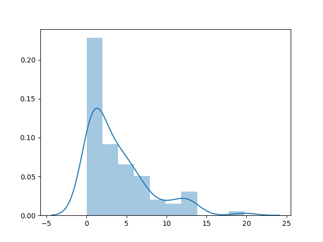
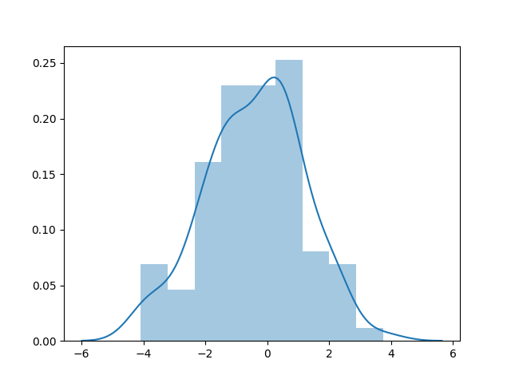
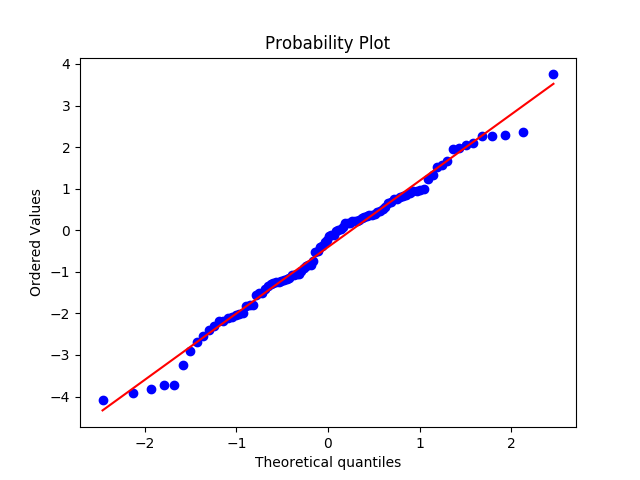
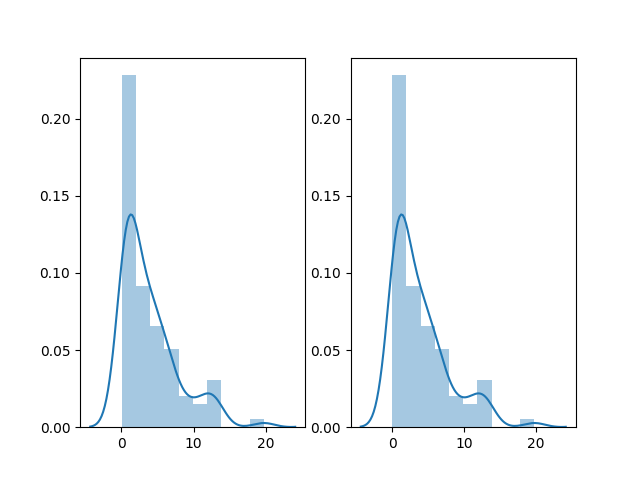

# Compositionally Warped Gaussian Processes
This package is dedicated to realizing methods used in this [paper](https://arxiv.org/abs/1906.09665).


## TLDR;
A package that transforms anything to a Gaussian distribution.

## Tutorial

Visit [here](./examples/cwgp_beta.ipynb)


## Quick Start

Let's randomly generate 100 numbers following an exponential distribution.
``` python
import numpy as np
import seaborn as sns

exp = np.random.exponential(scale=5, size=100)
```


We now instantiate a CWGP class consisting of 3 Sinh-Arcsinh transformations. 
``` python
from cwgp.cwgp import CWGP

compgp = CWGP("sa", n=3)
```

We then fit our data into the model. This minimizes the negative log likelihood function and stores the corresponding parameters for us.
``` python
compgp.fit(exp)
```

To get the parameters, we do
``` python
params = compgp.phi.res.x
```

We then transform the data via

``` python
t_exp, d = compgp.phi.comp_phi(params, exp)
sns.distplot(t_exp)
plt.show()
```


Let's make a QQ-plot and see how Gaussian it is.
``` python
from scipy import stats

stats.probplot(t_exp, dist="norm", plot=plt)
plt.show()
```


The inverse function is also implemented.
``` python
inv_t_exp = compgp.phi.inv_comp_phi(params, t_exp)
```

``` python
fig, ax = plt.subplots(1, 2)
sns.distplot(inv_t_exp, ax=ax[0])
sns.distplot(exp, ax=ax[1])
plt.show()
```

The one on the left is the one being transformed and transformed-back, and the one on the right is the original distribution.
They should be exactly the same.  


## Transformations

### Sinh-Arcsinh (sa)

`from cwgp.transformations import sa`

### Arcsinh (asinh)

`from cwgp.transformations import asinh`

### Box-Cox (box_cox)

`from cwgp.transformations import box_cox`

### Sinh-Arcsinh and Affine (SAL)

`from cwgp.transformations import sal`

## Kernels

### Ornstein-Uhlenbeck Kernel

`from cwgp.kernel import OU`

### Radial Basis function Kernel

`from cwgp.kernel import RBF`
